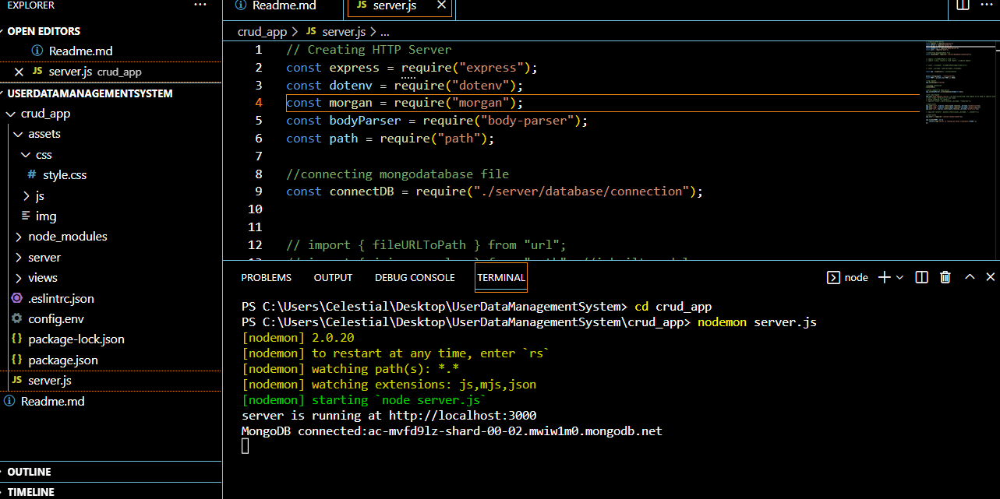
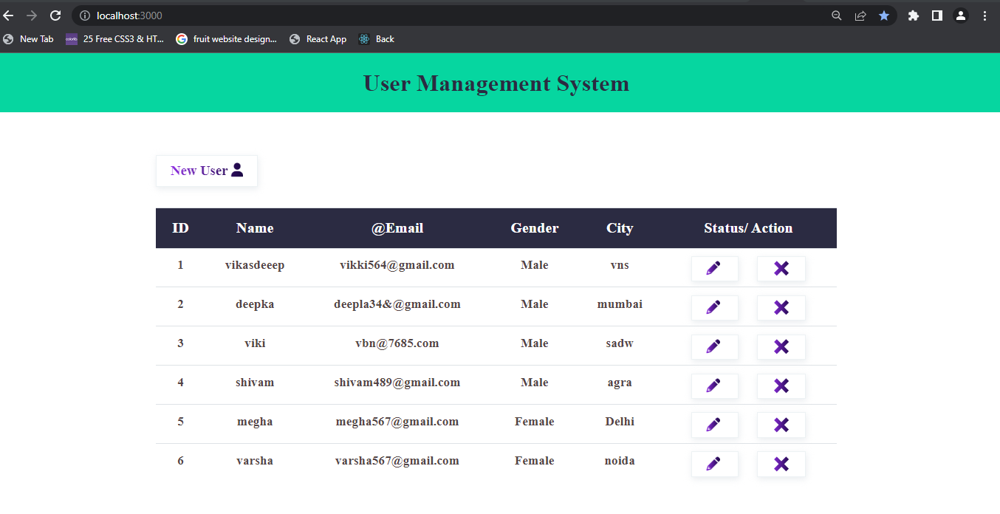
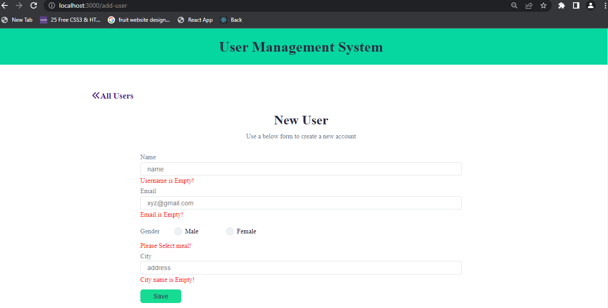
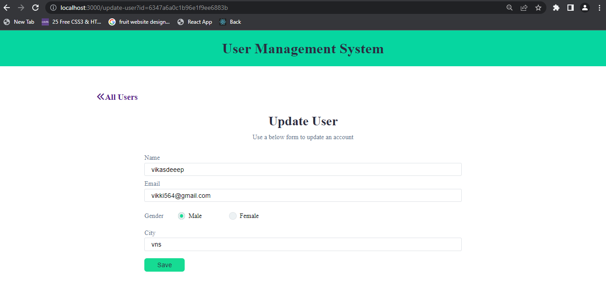

# User Management System 

## Poject Desrciption:

User Management System  is a web Application  made of using JavaScript's with back-end JavaScript runtime environment Nodejs, MongoDB Atlas. This is users data management application including form to add users data, a table that shows data after fetching from Axios, and contains button for updating and delete particular data whatever users want. This Project basically perform Complete CRUD Application with Node, Express & MongoDB.

## Technology Used:
### For Front-end:
- Javascript :- JavaScript is the Programming Language for the Web. JavaScript can update and change both HTML and CSS. JavaScript can calculate, manipulate and validate data.
- Basic CSS: used to provide basic comfortability to website.
- ejs:  EJS or Embedded Javascript Templating is a templating engine used by Node.js. Template engine helps to create an HTML template with minimal code. Also, it can inject data into HTML template at the client side and produce the final HTML. EJS is a simple templating language which is used to generate HTML markup with plain JavaScript.

### For Back-end:
- Nodejs- JavaScript runtime environment and library for running web applications outside the client's browser.Node.js uses JavaScript on the server.
- Express - Framework of Nodejs help us to create a http server.
- Morgan - morgan is a Node. js and Express middleware to log HTTP requests and errors, and simplifies the process.
- Body-Parser - It is responsible for parsing the incoming request bodies in a middleware before we handle it
- Axios - Axios is a promise-based HTTP library that lets developers make requests to either their own or a third-party server to fetch data.
- Dotenv - module allow us to store secret credential of documents.
- Mongoose - Allow us to work with mongoDB.
- Nodemon- Allow us to restart the server whenever we make changes in it. 

## URL
- URL for Home Page - http://localhost:3000/
-  URL for Adding new users Page- http://localhost:3000/add-user

## What I've Learnt :
- Setup of  Nodejs installation of Express, mongodb Atlas, etc.
- Setup ES Lint and identifying its error and resolving them.
- writing clean and structure code.
- Creating nodeAPIs.
- creating Routes.
- Creating models and schema.
- Get / post methods
- How to connect with mongoDbAtlas (cloud MongoDb Database).
- How to implement jquery with CDN link.
- how to make a CRUD application with MongoDB.

## Getting Started with Nodejs Application

This project start with:
open terminal and insert in crud_app folder and then type:- nodemon server.js
Like this-

Runs the app in development mode and 
Open [http://localhost:3000] to view it in your browser

### Home - Page

Table Data

- Table show data filled by user after fetching from API get data from mongodb Atlas.

### Add New User - Page

form

- form with prioper validation user need to fill data and save it data will get save in mongodb Atlas database.

### Update User - Page

form

- form with selected data values here user can update its record and submit it.